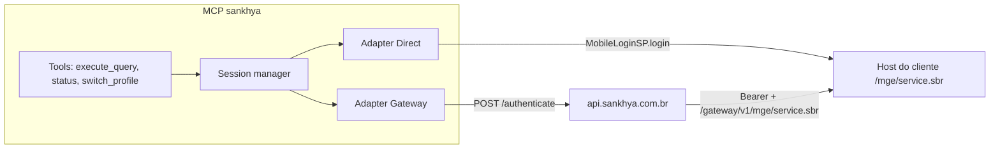

# Análise de viabilidade — MCP Sankhya (auth + query)

Documento de decisão para o Thiago. Objetivo: avaliar se vale criar MCPs para autenticar no Sankhya Om e executar queries, e como isso deve ser desenhado.

Fontes cruzadas:

- Chamadas já homologadas no Postman (`MobileLoginSP.login`, `DbExplorerSP.executeQuery`, `ExecQuerySP.execQuery`)
- [API de Integrações Sankhya](https://developer.sankhya.com.br/reference/api-de-integra%C3%A7%C3%B5es-sankhya)
- [POST `/authenticate`](https://developer.sankhya.com.br/reference/post_authenticate) (OAuth 2.0 vigente)
- [POST `/login`](https://developer.sankhya.com.br/reference/post_login-1) (legado / descontinuado)
- [Requisições via Gateway](https://developer.sankhya.com.br/reference/requisi%C3%A7%C3%B5es-via-gateway)
- [Boas práticas de integração](https://developer.sankhya.com.br/reference/boas-pr%C3%A1ticas-para-integra%C3%A7%C3%A3o)
- Skill local de dicionário Sankhya (TDD: ~3.397 tabelas, ~45.312 campos)

---

## 1. Veredito

**Sim, é viável.** A fatia auth + execução de query é a mais barata e a mais útil para suporte, troubleshooting e análise. As APIs já estão homologadas. O MCP, neste caso, é um cliente HTTP com sessão, guardrails e um contrato de tools para o modelo.

O ponto que muda o projeto não é “dá para chamar o `service.sbr`?”. Dá. O ponto é **como** empacotar isso para um LLM sem virar um shell SQL contra produção.

Recomendação curta:

1. **Um único MCP**, não dois.
2. **Autenticação como infraestrutura**, não como tool obrigatória.
3. **Dois adaptadores de auth** (host direto e Gateway), mesma tool de query.
4. **Query read-only**, com teto de linhas e resposta truncada para caber no contexto.
5. **Dicionário no skill do Cursor**, com tools compactas de lookup depois — não dump de 45 mil campos no MCP.

---

## 2. O que o MCP precisa resolver de verdade

Hoje o fluxo manual é:

1. Logar (host do cliente **ou** Gateway).
2. Guardar `jsessionId` / `bearerToken`.
3. Montar `service.sbr` com cookie, query param ou `Authorization`.
4. Enviar XML ou JSON.
5. Interpretar envelope Sankhya (`status`, `statusMessage`, `responseBody`).

Um agente de IA quebra nesse fluxo se:

- precisar “lembrar” de logar antes de cada query;
- a sessão expirar no meio da conversa;
- o resultado tiver 5.000 linhas;
- a query for `UPDATE` / `DELETE` / `TRUNCATE` gerada por alucinação;
- o token vazar no texto da tool (URL com `mgeSession=` entra em log, transcript e screenshot).

O MCP existe para esconder isso. A tool que o modelo vê deve ser próxima de: “rode este SELECT no cliente X, no máximo N linhas”.

---

## 3. Autenticação — dois mundos, um contrato interno

São mecanismos diferentes. Não unifique no HTTP; unifique atrás de um `SankhyaClient`.



### 3.1 Host direto (o que você já usa no Postman)

| Item | Detalhe |
|------|---------|
| Serviço | `MobileLoginSP.login` |
| Corpo | `NOMUSU`, `INTERNO`, opcional `KEEPCONNECTED: S` |
| Retorno | `jsessionId` |
| Como autenticar o resto | Cookie `JSESSIONID` **e/ou** query `mgeSession` |
| Quando usar | On-prem, VPN, IP interno (`10.x`), laboratório, suporte no servidor do cliente |
| Doc oficial | Em ambiente **sem** Gateway, MobileLogin é obrigatório. Com Gateway, **não**. |

Preferir cookie a `mgeSession` na URL. Token na query string aparece em access log, Postman history, print e transcript do agente.

`KEEPCONNECTED: S` reduz atrito em sessão longa de suporte. Ainda assim o MCP deve relogar em `401` / sessão inválida, sem o modelo “descobrir” isso.

### 3.2 Gateway (padrão oficial de integração)

Três peças, papéis distintos:

| Dado | Origem | Função |
|------|--------|--------|
| `client_id` / `client_secret` | Portal do Desenvolvedor (componente tipo Integração) | Identifica a aplicação |
| `X-Token` | Tela **Configurações Gateway** no Om do cliente | Liga a app ao tenant |
| Usuário de integração | Mesma tela, usuário Om | Permissões reais no ERP |

Fluxo **vigente**: `POST https://api.sankhya.com.br/authenticate` (OAuth 2.0 Client Credentials + header `X-Token`). Retorna JWT `access_token`. Na documentação o `expires_in` de exemplo é **300 segundos**. O MCP **precisa cachear e renovar**; logar a cada query é errado e vai bater no rate limit.

Fluxo **legado**: `POST /login` com headers `token`, `appkey`, `username`, `password`. A própria Sankhya marca como descontinuado e pede migração para `/authenticate`. Sessão ~30 min de inatividade (`INATSESSTIMEOUT`). Útil só para compatibilizar coleções Postman antigas.

Chamada de serviço depois do token:

```
https://api.sankhya.com.br/gateway/v1/{modulo}/service.sbr?serviceName=...&outputType=json
Authorization: Bearer {access_token}
```

Módulo importa. Query/cadastros genéricos = `mge`. Pedido/faturamento = `mgecom`. `DbExplorerSP.executeQuery` está documentado no **MGE**. Logout documentado: `MobileLoginSP.logout` no path `/gateway/v1/mge/service.sbr`.

Limites oficiais do Gateway: **1.000 req/min**, body **10 MB**, processamento no cliente até **2 min**. Timeout de query pesada é problema do Om do cliente, não do MCP — o MCP precisa timeout próprio (ex.: 60s) e mensagem clara.

### 3.3 Compliance versus uso de consultoria

A Sankhya trata como inadequado, para clientes a partir de **01/02/2023**:

- acesso direto ao banco;
- API direto no Om **sem** Gateway.

Isso vale para **produto de integração** (parceiro → cliente). Para o seu caso de **ferramenta local de suporte**, o host direto continua sendo o caminho operacional: muitos ambientes só existem na rede do cliente, e o Gateway nem está liberado.

Desenho honesto:

| Uso | Auth |
|-----|------|
| Você no Cursor, VPN no cliente, troubleshooting | Direct |
| App/produto reutilizável em vários tenants | Gateway + `/authenticate` |
| Cliente antigo, coleção Postman com appkey | Gateway `/login` como fallback explícito |

O MCP deve selecionar o modo por **perfil de cliente** (`direct` | `gateway-oauth` | `gateway-legacy`), não por if espalhado nas tools.

---

## 4. Serviços de query — o que usar

Você homologou dois caminhos reais (o terceiro curl da mensagem é o `ExecQuery` de novo).

| | `DbExplorerSP.executeQuery` | `ExecQuerySP.execQuery` |
|--|----------------------------|-------------------------|
| Envelope | JSON (`sql` no `requestBody`) | XML (`querydata` + `config maxRows`) |
| Limite | ~5.000 registros (limitação do explorer) | `maxRows` configurável (ex.: 2000 no gadget) |
| Módulo | `mge` (citado na doc de Gateway) | `mge`, típico de GadgetBuilder |
| Extra | `outputType=json` | Na prática XML; `application` / `resourceID` do gadget |
| HTTP | Seus curls usam GET+body; o correto no MCP é **POST** | Idem |

Recomendação de implementação:

1. **Padrão da tool:** `DbExplorerSP.executeQuery` + JSON. Mais simples de parsear, já está na lista oficial de serviços MGE do Gateway.
2. **Quando `maxRows` > 5.000 ou o explorer recusar:** cair para `ExecQuerySP.execQuery`.
3. **Teto do MCP** independente do Sankhya: default **200** linhas, máximo configurável **2.000** na tool. Acima disso o modelo afoga o contexto e o Om sofre.
4. Sempre devolver: colunas, N linhas, `truncated: true/false`, `rowCount`. Nunca o XML/JSON cru do envelope, a menos que a tool de debug esteja ligada.

`CRUDServiceProvider.loadRecords` / `loadRecord` / `loadView` são o caminho “de produto” (entidade `Produto` → `TGFPRO`, campos calculados, critérios tipados). São **piores** para troubleshooting ad hoc (“me mostra TGFFIN com `PROVISAO='N'` e `DHBAIXA IS NULL`”) e **melhores** se no futuro a tool for “buscar parceiro por CNPJ”. Não misturar na v1 da query livre.

---

## 5. Dicionário + MCP

A skill `sankhya-dicionario` e o MCP de query se complementam. Não são o mesmo componente.

| Camada | Papel |
|--------|--------|
| Skill / docs TDD | Ensinar o modelo a montar SQL certo (`TGFEST` vs `TGFCTE`, `STATUSNOTA='L'`, `RECDESP` inteiro, join financeiro por `NUMNOTA+SERIENOTA`) |
| MCP `execute_query` | Rodar no Om real e trazer dado |
| MCP `search_table` / `describe_table` (fase 2) | Lookup pontual (“quais campos de TGFFIN?”) sobre um índice local compacto |

O que **não** fazer: uma tool que devolve 45 mil campos. Estoura contexto, custa token e o modelo usa mal.

Fluxo desejado no Cursor:

1. Usuário: “por que o título 123 não baixou no cliente X?”
2. Modelo consulta o dicionário (skill) e monta um SELECT defensivo.
3. MCP executa no perfil do cliente.
4. Modelo interpreta o recorte (poucas linhas, colunas úteis).

Se o índice TDD virar dado versionado neste repo (JSON/SQLite gerado das TDD), as tools de describe ficam rápidas e offline. A execução continua dependendo de rede até o Om.

---

## 6. Arquitetura recomendada (um MCP)

Nome: `sankhya` (um servidor). Transporte inicial: **stdio** no Cursor Desktop. Não começar remoto/HTTP.

### Tools da v1

| Tool | O modelo vê | Implementação |
|------|-------------|---------------|
| `sankhya_status` | perfil ativo, modo de auth, se a sessão está viva. **Sem** token. | healthcheck barato |
| `sankhya_execute_query` | `sql`, `max_rows?`, `profile?` | session ensure → POST service → parse → truncate |
| `sankhya_switch_profile` | troca de cliente | só se houver multi-cliente |

`sankhya_login` **não** deve ser obrigatório. Login lazy na primeira query. Relogin em sessão morta. Logout no shutdown, se o modo Gateway documentar isso.

### Tools que ficam de fora da v1

- `call_service(serviceName, body)` genérico — o modelo inventa payload e chama `CACSP.cancelarNota`.
- Qualquer DML.
- Upload de XML de NF-e, faturamento, baixa.

Escrita (pedido, parceiro) só como **tools tipadas**, copiadas das coleções Postman já homologadas, com schema rígido.

### Perfil de cliente (1Password, não chat)

Fonte da verdade: vault **Sankhya – Clientes** no 1Password da equipe, via CLI `op` (item pelo título = nome do perfil). Referenciar o vault pelo **ID**, não pelo nome (o traço do título não é hífen ASCII).

Cada item hoje é um Login de consultoria. O MCP lê só campos estruturados e **ignora `notesPlain`** (lá entram VPN, RDP, banco — isso não vai para o modelo).

| Campo do Login | Uso |
|----------------|-----|
| título | `profile` (`Garra`, `Fralia`, …) |
| `username` | `NOMUSU` no `MobileLoginSP` |
| `password` | `INTERNO` (só o campo senha do Login, com `--reveal` interno) |
| URL primária | `base_url` do Om; strip de `/mge/` e path |

Variáveis de ambiente continuam só como escape hatch (um cliente, máquina sem `op`).

#### Regra de modo (fechada)

**Default: `direct`.** Hoje todos os clientes no cofre são host direto. Alguns já têm Gateway na Sankhya, mas **isso não está no 1Password** — o MCP não adivinha.

Gateway **somente** quando o item tiver **os quatro** de propósito:

1. `mode` = `gateway` (comparação case-insensitive)
2. `client_id`
3. `client_secret`
4. `x_token`

Qualquer outra combinação (`mode=gateway` sem as três chaves, ou as três chaves sem `mode`) **não** ativa Gateway: o MCP permanece em `direct` e avisa no `sankhya_status` que o item está incompleto. Não existe modo “meio gateway”.

```text
se mode == gateway
   e client_id, client_secret, x_token preenchidos
     → adapter Gateway (POST /authenticate)
senão
     → adapter Direct (MobileLoginSP no host da URL)
```

Quando um cliente passar a ser Gateway de verdade, o trabalho é no cofre: criar/preencher esses quatro campos no item. Sem mudança de código.

O processo do MCP roda **na máquina que alcança o ERP**. IP interno e host `*.snk.ativy.com` exigem VPN. Cursor Cloud Agent não substitui isso. Gateway (`api.sankhya.com.br`) é a exceção pública — e ainda assim o processamento cai no Om do cliente.

### Stack

TypeScript + `@modelcontextprotocol/sdk` (stdio). Motivos: SDK de referência do MCP, JSON nativo, encaixa no `mcp.json` do Cursor. Python também serve; não há ganho de negócio em discutir stack aqui.

---

## 7. Riscos e mitigações

| Risco | Gravidade | Mitigação |
|-------|-----------|-----------|
| LLM gera `DELETE` / `UPDATE` / `DROP` | Crítica | Parser: somente `SELECT` / `WITH … SELECT`. Recusar o resto. Sem flag “liberar DML” na v1. |
| Resultado enorme explode o contexto | Alta | `max_rows` default 200; truncar colunas longas; devolver amostra + contagem. |
| Token/`jsessionId` no output da tool | Alta | Sanitizar respostas e erros. Cookie, não query string. Nunca logar `Authorization`. |
| Sessão Gateway de 5 min | Média | Cache + refresh por `expires_in`; retry 1x em 401. |
| Query pesada derruba o Om | Alta | Timeout do cliente HTTP; desencorajar `SELECT *` sem `WHERE` em tabelas grandes (`TGFCAB`, `TGFFIN`, `TGFITE`). |
| Multi-cliente, credencial errada | Alta | Perfis isolados; profile explícito; recusar default silencioso em config com 2+ clientes. |
| ExecQuery XML vs DbExplorer JSON | Baixa | Adapter por serviço; normalizar para `{ columns, rows }`. |
| GET+body (Postman) | Baixa | MCP usa POST. |
| Compliance Gateway em cliente 2023+ | Média (produto) / baixa (uso interno) | Documentar o modo no perfil; não vender host direto como “integração oficial”. |
| Campos calculados / views lentas | Média | Mesmo aviso da Sankhya para `loadRecords`/`loadView`: filtro estreito, sem `SELECT *` em view pesada. |

Armadilhas de dicionário que o MCP **não** corrige sozinho — o skill precisa continuar no contexto:

- estoque atual está em `TGFEST.ESTOQUE`, não em `TGFCTE`;
- nota confirmada é `STATUSNOTA = 'L'`;
- título aberto: `PROVISAO = 'N'` e `DHBAIXA IS NULL`;
- `NUNOTA` é chave interna; número impresso é `NUMNOTA`;
- `TGFFIN` não junta por `NUNOTA`;
- `RECDESP` é `1` / `-1`, não `'R'`/`'D'`.

---

## 8. Por que **não** dois MCPs (auth + query)

Separar “MCP de login” e “MCP de query” parece limpo no papel e quebra na prática:

1. **Sessão não atravessa processo.** Cada MCP é um subprocesso. O query server não herda o cookie do auth server, a menos que vocês inventem um store compartilhado (arquivo, Redis) — complexidade sem ganho.
2. **O modelo é péssimo gerente de sessão.** Ele esquece de logar, loga duas vezes, cola `mgeSession` vencido no próximo turno.
3. **Config duplicada** no `mcp.json` (host, user, token).
4. Auth não é capacidade de negócio. É detalhe de transporte, igual `Content-Type`.

Um servidor, várias tools, sessão *in-process*. Se no futuro houver MCP de “pedidos” e MCP de “parceiros”, ainda assim a sessão deve viver numa **lib compartilhada**, não num MCP de login.

---

## 9. Opinião profissional

Este projeto vale a pena se o uso principal é **você (e o time) no Cursor**, contra ambientes reais, para diagnosticar e explicar dados. Aí o ROI é imediato: o modelo deixa de alucinar TGF e passa a citar linhas que existiram no Om.

Ele **não** vale a pena, nesta forma, se a ideia for “expor SQL livre como produto para o cliente final”. Aí o caminho certo é entidade (`loadRecords`), telas, e permissão do usuário de integração — não `DbExplorer`.

Sobre auth: implemente os dois adaptadores na v1. Vocês já vivem os dois mundos. Gateway OAuth é o que a Sankhya vai continuar evoluindo; host direto é o que paga o suporte amanhã. Não comece só no Gateway e deixe o Postman de 10.10.10.35 de fora — nem o contrário.

Sobre query: comece **estreito e chato**. SELECT, 200 linhas, JSON, um perfil. Resista ao `call_service` genérico. Cada serviço de escrita que vocês já homologaram (parceiro, pedido) vira uma tool nova, com schema, não um JSON livre.

Sobre dicionário: a skill que você já tem é o diferencial. Sem ela, o MCP executa SQL ruim com confiança. Com ela, o MCP vira o braço que busca evidência. Mantenha os dois acoplados por fluxo de trabalho, não por um único binário inflado.

Restrição de rede, dita sem rodeio: **este MCP é local**. Roda onde a VPN/Gateway alcança o Om. Não planeje isso como serviço na nuvem na primeira fatia.

Viabilidade técnica da fatia auth+query: **alta**. Risco operacional se SQL ficar irrestrito: **alto**. O desenho acima existe para ficar com a primeira e matar a segunda.

---

## 10. Fatia seguinte (quando for para código)

Ordem que eu seguiria:

1. Lib `SankhyaClient`: login direct + gateway-oauth, cookie/Bearer, retry 401, logout.
2. Tool `sankhya_execute_query` via `DbExplorerSP.executeQuery`, SELECT-only, normalização de resultado.
3. Perfis por env/arquivo, `sankhya_status`.
4. Fallback `ExecQuerySP.execQuery` se precisar de `maxRows` maior.
5. Tools `describe_table` / `search_field` em cima do TDD local.
6. Só então tools de escrita copiadas do Postman (`CACSP.IncluirNota`, cadastro de parceiro, etc.).

Critério de pronto da v1: no Cursor, com VPN no cliente de homologação, perguntar “lista 10 produtos de `TGFPRO`” e receber tabela — sem colar sessão na URL e sem o modelo ter chamado login.
